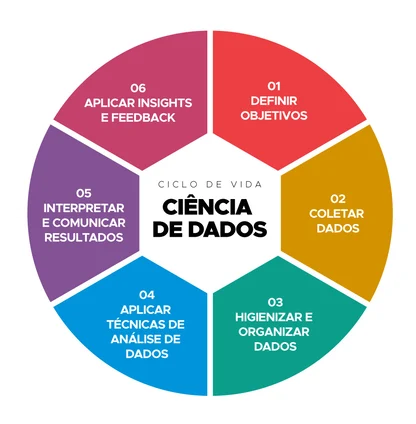
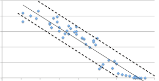

#Data Science

##O que é Data Science?
    ##__**Data Science é transformar dados brutos em decisões com impacto**__

")

##O que fazemos quando fazemos Data Science?
    1. Coleta                                   
        ⬇
    2. Limpeza e preparação                     
        ⬇
    3. Análise Explanatória (EDA)
        ⬇               
    4. Modelagem estatistica ou preditiva
        ⬇       
    5. Deploy (Produção ou Uso prático)
        ⬇         
    6. Feedback & melhoriaa contínua            
    
##O ciclo da Ciência de dados

## Um insight é uma resposta estatístca (Positiva ou negativa da predição)

##Onde a ciência de dados esta mudamdo o jogo?
    |  | Header 2 |
    | :------- | :------: | 
    | Data A1  | Data B1  | 
    | Data A2  | Data B2  | 
    | Data A2  | Data B2  | 
    | Data A2  | Data B2  | 
    | Data A2  | Data B2  | 
    | Data A2  | Data B2  | 
